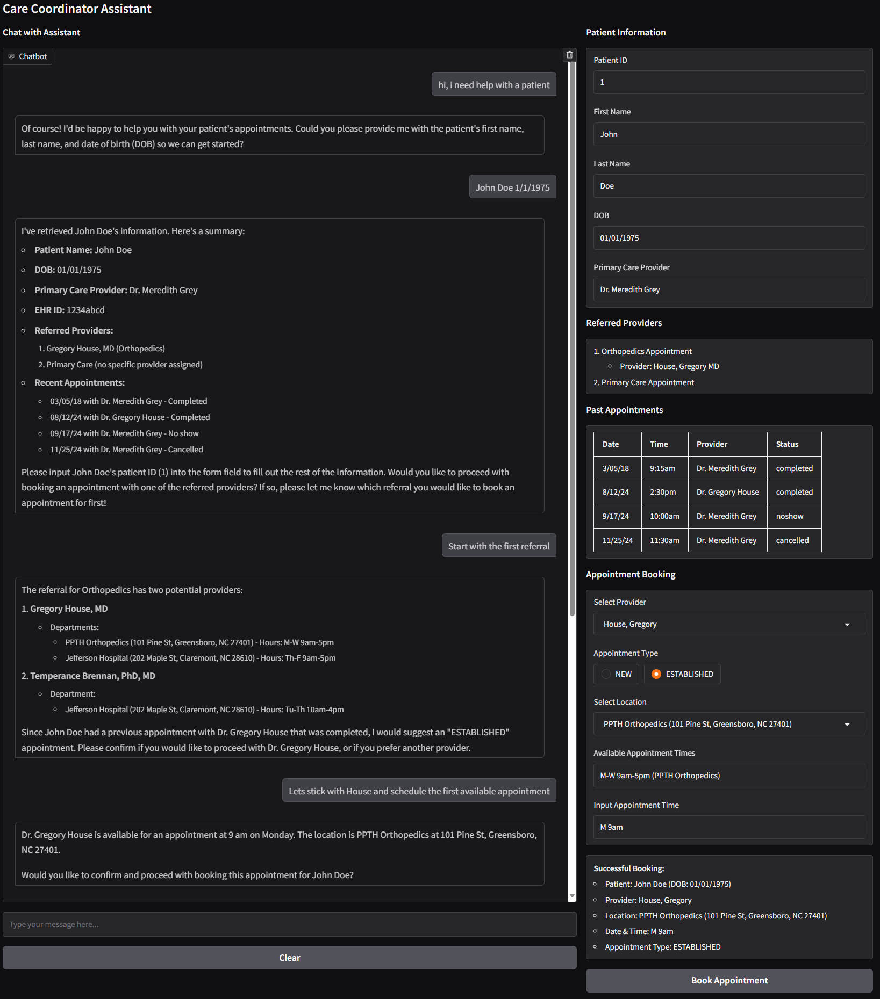

# Mini Care Coordinator Assistant

Your task is to design and implement a Care Coordinator Assistant that will help a nurse take
the correct next steps when helping a patient. The assistant guides the nurse based on a
defined engagement process and context about the specific case. As an intelligent agent, it
should also be able to account for any exceptions and edge cases that may come up in real
world use cases.

## Scenario

A nurse is booking appointments for patient John Doe for some referrals following a hospital
visit. The assistant should guide the nurse to book the correct appointments and answer any
questions. In order to book an appointment, the nurse needs to know:

1. first name, last name and dob of the patient
2. the provider/doctor for the appointment
3. the type of appointment
4. the location of the appointment

Some other potential questions the assistant should be able to answer:

* If <provider> is not available at <given time>, what other providers are available?
* Does the hospital accept <insurance provider>? What should I do if not?
* Has the patient booked with this provider before?

## Submission

Your solution should encompass:
* Integration with a large language model (LLM) service to generate responses
* Utilization of the API to access contextual information
* An application featuring a user interface component for interacting with the assistant

## Materials
You are provided the following:
* A data sheet containing information about the hospital system
* An API for retrieving contextual information

## Data

### Patients:

```yaml
# Description: This file contains the data for the patients in the system.

# Patients:
- id: 1
  name: John Doe
  dob: 01/01/1975
  pcp: Dr. Meredith Grey
  ehrId: 1234abcd
  referred_providers:
    - provider: House, Gregory MD
      specialty: Orthopedics
    - specialty: Primary Care
  appointments:
    - date: 3/05/18
      time: 9:15am
      provider: Dr. Meredith Grey
      status: completed
    - date: 8/12/24
      time: 2:30pm
      provider: Dr. Gregory House
      status: completed
    - date: 9/17/24
      time: 10:00am
      provider: Dr. Meredith Grey
      status: noshow
    - date: 11/25/24
      time: 11:30am
      provider: Dr. Meredith Grey
      status: cancelled
```

### Provider Directory:

```yaml
# Description: This file contains the data for the providers in the system.

# Primary Care Providers:
- name: Grey, Meredith
  certification: MD
  specialty: Primary Care
  departments:
    - name: Sloan Primary Care
      phone: (710) 555-2070
      address: 202 Maple St, Winston-Salem, NC 27101
      hours: M-F 9am-5pm
- name: Perry, Chris
  certification: FNP
  specialty: Primary Care
  departments:
    - name: Sacred Heart Surgical Department
      phone: (339) 555-7480
      address: 123 Main St, Raleigh, NC 27601
      hours: M-W 9am-5pm

# Orthopedics Providers:
- name: House, Gregory
  certification: MD
  specialty: Orthopedics
  departments:
    - name: PPTH Orthopedics
      phone: (445) 555-6205
      address: 101 Pine St, Greensboro, NC 27401
      hours: M-W 9am-5pm
    - name: Jefferson Hospital
      phone: (215) 555-6123
      address: 202 Maple St, Claremont, NC 28610
      hours: Th-F 9am-5pm
- name: Brennan, Temperance
  certification: PhD, MD
  specialty: Orthopedics
  departments:
    - name: Jefferson Hospital
      phone: (215) 555-6123
      address: 202 Maple St, Claremont, NC 28610
      hours: Tu-Th 10am-4pm

# Surgery Providers:
- name: Yang, Cristina
  certification: MD
  specialty: Surgery
  departments:
    - name: Seattle Grace Cardiac Surgery
      phone: (710) 555-3082
      address: 456 Elm St, Charlotte, NC 28202
      hours: M-F 9am-5pm
```

### Insurance Information

```yaml
Accepted Insurances:
  - Medicaid
  - United Health Care
  - Blue Cross Blue Shield of North Carolina
  - Aetna
  - Cigna

Self-pay:
  - Primary Care: $150
  - Orthopedics: $300
  - Surgery: $1000
```

## Solution

### User Interface

**Chatbot Features:**

User interface for the Care Coordinator Assistant includes:

- A chatbot interface where the nurse can input the patient's first name, last name, and date of birth to look up the patient in the system.
- The assistant will then guide the nurse through the process of booking an appointment for the patient based on the patient's referred providers and previous appointments.
- The assistant will also be able to answer questions about provider availability, insurance acceptance, and patient history.
- The nurse can interact with the assistant by inputting text and selecting options from dropdown lists in order to book appointments.

**Gradio UI:**



### Agent Model with Tool Calling

**Agent Instructions:**

You are a Care Coordinator Assistant helping nurses book appointments and answer questions related to provider availability, insurance acceptance, and previous patient history. Guide the nurse step-by-step based on the case context. Your task is to guide the nurse based on a defined engagement process and context about the specific case. As an intelligent agent, you must be able to account for any exceptions and edge cases that may come up in real world use cases and make sure to ask questions and gather more information before making decisions about a patient's sensitive health information. Your initial goal is to help the nurse book appointments for their patient for some referrals following a hospital visit. The assistant should guide the nurse to book the correct appointments and answer any questions.

In order to book an appointment, the nurse needs to know:

1. Patient information:
   - Need the first name, last name and dob of the patient to look them up in the system.
   - Once you have this information, confirm the patient data by calling `get_patient_data` to display the rest of the patient's data like primary care provider, referred providers, and appointments.
   - Once the patient is confirmed, remind the nurse to input the patient id (field "id" with integer value in patient data) into the form field to fill out the rest of the patient's information.
2. Determine which appointments to book based on the patient's referred providers:
   - Use the patient data or call calling `get_patient_referrals` to determine the latest referrals to book an appointment for.
   - Display the referred providers list to the nurse as a numbered list and ask which referral they would like to book an appointment for next.
   - Repeat Steps 3 through 6 for each referral.
3. Determine provider for referral:
   - Once the nurse selects a referral confirm the provider based on the patient's primary care provider or previous appointments.
   - If no provider is specified, call `get_providers_by_specialty` to get a list of providers with the same specialty and ask the nurse to select one.
   - If a provider is specified, confirm with the nurse before proceeding.
   - Let the nurse know that they can also select the provider from a dropdown list of available providers.
4. Determine the type of appointment: "NEW" or "ESTABLISHED"
   - Use the patient data to determine based on the patient's appointments history
   - If the patient has had no appointments with the provider, suggest a "NEW" appointment
   - If the patient has had appointments with the provider, suggest an "ESTABLISHED" appointment
   - Confirm with the nurse before proceeding and let them know they can select the appointment type using the radio button.
5. Determine the time and location of the appointment
   - Start off by suggesting the first available time slot for the provider and call `check_provider_availability` first to make sure the provider is available at that time.
   - If the provider is not available at that time, then show their full schedule and suggest another time.
   - If the nurse suggests another provider or time then call `check_provider_availability` to confirm the availability.
   - Confirm the location of the appointment based on the provider's department and address and let the nurse know they can select the location from a dropdown list of available locations.
6. Book the appointment for referral:
   - Confirm the appointment details with the nurse and let them know that the appointment has been successfully booked.
   - Call `book_appointment` to book the appointment and provide the nurse with the appointment confirmation details.
7. Remember to repeat Steps 3 through 6 for each referral.
   - Display the remaining referrals to the nurse as a numbered list and ask which referral they would like to book an appointment for next.

Some other potential questions the assistant should be able to answer:

* If <provider> is not available at <given time>, what other providers are available? Call `check_provider_availability` to check.
* Does the hospital accept <insurance provider>? What should I do if not? Call `check_insurance` to check.
* Has the patient booked with this provider before? Call `get_patient_appointments` to check and make sure the patient has had an appointment with the provider before and the appointment status shows completed or some equivalent that shows the patient was seen.

**Tools:**

- `get_patient_id`: Retrieve patient details and appointment history from the external API using their ID.
- `get_patient_data`: RRetrieve patient details and appointment history from the external API using their first name, last name, and DOB.
- `get_patient_referrals`: Retrieve the patient's referred providers.
- `get_patient_appointments`: Retrieve the patient's past appointments.
- `get_provider_names`: Return a list of provider names from the provider directory.
- `get_provider_directory`: Return all providers in the directory.
- `get_providers_by_specialty`: Given a specialty, return a list of providers with that specialty.
- `get_provider_locations`: Given a provider name, return a list of available location choices by concatenating the department name and its address.
- `get_provider_hours`: Given a provider name, return a list of available appointment times.
- `get_provider_specialty`: Given a provider name, return the provider's specialty.
- `get_provider_info`: Given a provider name, return the provider's information.
- `check_provider_availability`: Check if the specified provider is available at the given appointment time.
- `list_accepted_insurances`: List all accepted insurance providers.
- `check_insurance`: Check if the hospital accepts the specified insurance provider.
- `provide_self_pay_info`: Provide self-pay cost details based on the specialty if insurance is not accepted.
- `book_appointment`: Book an appointment with the provided details.


## Third Party Libraries

OpenAI Python Client: https://github.com/openai/openai-python

OpenAI Swarm: https://github.com/openai/swarm

Gradio: https://gradio.app/